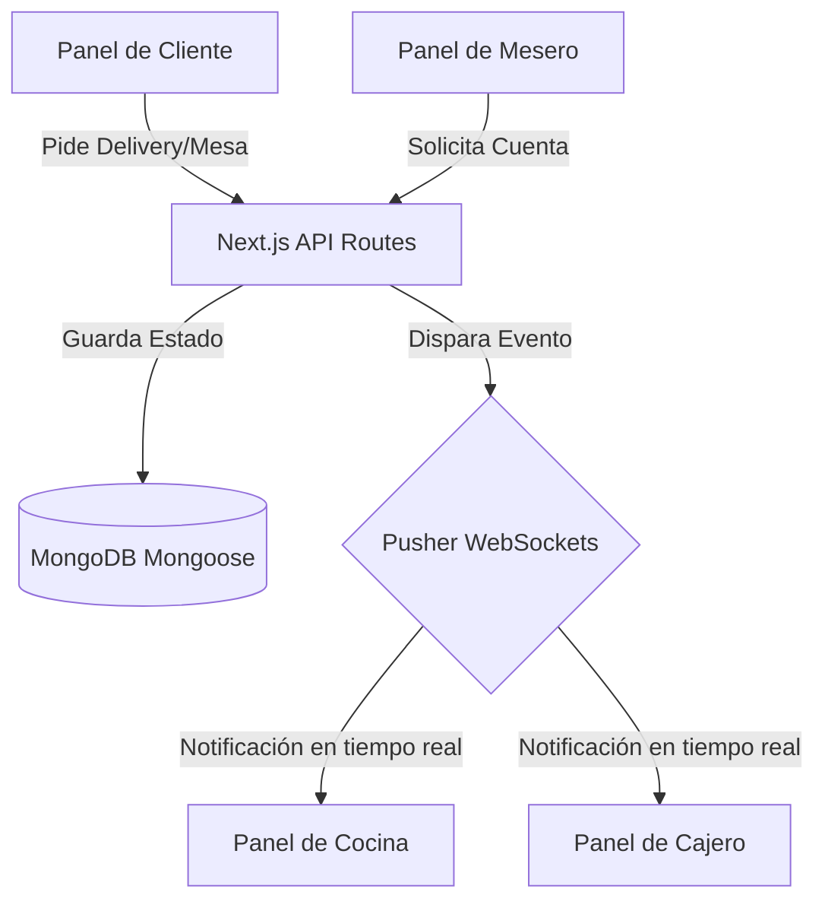

# Sabor & Gestión

Plataforma modular y escalable para la administración integral de restaurantes y cafeterías, diseñada para coordinar pedidos, cobros, cocina y segmentación de clientes en tiempo real.

---

## 🛠️ Tecnologías Utilizadas

El proyecto está construido con un stack moderno y eficiente para garantizar velocidad, escalabilidad y una experiencia de usuario fluida:

* **Frontend & Backend (Fullstack):** [Next.js (App Router)](https://nextjs.org/) (React 19, TypeScript)
* **Base de Datos:** [MongoDB](https://www.mongodb.com/) con [Mongoose](https://mongoosejs.com/) como ODM.
* **Tiempo Real (WebSockets):** [Pusher Channels](https://pusher.com/) para notificaciones instantáneas de pedidos en cocina y caja.
* **Estilos:** [Tailwind CSS v4](https://tailwindcss.com/) para un diseño responsivo y moderno.
* **Aplicación PWA:** Soporte de **PWA (Progressive Web App)** mediante `@ducanh2912/next-pwa` para instalación directa desde el navegador y soporte offline.
* **Mapas y Geolocalización:** [Leaflet](https://leafletjs.com/) y [React Leaflet](https://react-leaflet.js.org/) para el rastreo del delivery en tiempo real.
* **Gráficas:** [Recharts](https://recharts.org/) para la visualización de métricas en el panel de administración.
* **Seguridad y Envío de Correos:** JSON Web Tokens (JWT) con bcryptjs para autenticación, y Nodemailer para notificaciones automáticas vía email.

---

## 🗺️ Arquitectura del Proyecto y Flujo de Trabajo

El sistema está desarrollado con **Next.js (App Router)** y sigue una arquitectura limpia que separa la interfaz de usuario, la lógica de negocio y las configuraciones del servidor. 

La sincronización en tiempo real entre los diferentes roles (clientes, meseros, cocina y cajeros) se realiza a través de WebSockets (Pusher):



---

## 📁 Estructura del Código

```bash
src/
├─ app/                 # Rutas de la aplicación Next.js (App Router)
│  ├─ api/              # Endpoints del Backend (Serverless Functions)
│  │  ├─ auth/          # Lógica de autenticación (JWT, Login)
│  │  ├─ users/         # CRUD de usuarios y empleados
│  │  ├─ categories/    # Gestión de categorías del menú
│  │  ├─ dishes/        # Gestión del menú de platos
│  │  └─ admin/         # Rutas de administración y segmentación
│  ├─ login/            # Vista de inicio de sesión
│  ├─ dashboard/        # Panel principal de administración y roles
│  ├─ layout.tsx        # Estructura y envolturas base de la aplicación
│  └─ page.tsx          # Página de inicio (Landing/Root)
│
├─ components/          # Componentes de React reutilizables
│  ├─ ui/               # Botones, inputs, modales (piezas básicas)
│  ├─ forms/            # Formularios complejos (Login, registro de platos)
│  ├─ layout/           # Barras laterales, navegación, headers
│  └─ clientScreen/     # Vistas y paneles específicos para el rol Cliente
│
├─ features/            # Lógica de negocio específica por módulo
│  ├─ auth/             # Hooks y lógica de autenticación
│  ├─ users/            # Funcionalidades específicas de usuarios
│  ├─ categories/       # Operaciones de categorías
│  └─ dishes/           # Operaciones de platos y menú
│
├─ lib/                 # Utilidades y configuraciones externas
│  ├─ db.ts             # Configuración y conexión a MongoDB (Mongoose)
│  └─ utils.ts          # Funciones auxiliares generales
│
├─ models/              # Esquemas de Mongoose (Modelos de Base de Datos)
│  ├─ User.ts           # Modelo de Usuario (Roles, contraseñas)
│  ├─ Category.ts       # Modelo de Categoría
│  ├─ LoyaltyTier.ts    # Modelo de Reglas de Segmentación
│  └─ Dish.ts           # Modelo de Plato/Producto
│
├─ validations/         # Esquemas de validación de datos
│  └─ ...               # Validación de inputs para evitar datos corruptos
│
├─ types/               # Definiciones de TypeScript e Interfaces
│  └─ index.ts          # Centralización de tipos del proyecto
│
└─ tests/               # Suite de pruebas
   ├─ unit/             # Pruebas de funciones aisladas
   └─ integration/      # Pruebas de flujo completo
```

---

## 🐳 Base de Datos Local con Docker Compose

El proyecto incluye una configuración de **Docker Compose** para levantar una base de datos **MongoDB** local con Replica Set. Esto permite trabajar en desarrollo sin instalar MongoDB directamente en el sistema y mantiene soporte para transacciones.

### 📋 Requisitos Previos
* Tener [Docker Desktop](https://www.docker.com/products/docker-desktop/) instalado y ejecutándose en tu sistema.

### 🚀 Pasos para Iniciar la Base de Datos Local
Tus compañeros o tú pueden iniciar MongoDB local siguiendo estos pasos:

1. **Crear tu archivo de configuración local:**
   Copia el archivo de plantilla `.env.example` y nómbralo como `.env.local`:
   ```bash
   cp .env.example .env.local
   ```
   Asegúrate de que la variable `MONGO_URI` apunte a MongoDB local:
   ```env
   MONGO_URI=mongodb://localhost:27017/sabor-gestion?replicaSet=rs0
   ```

2. **Levantar los servicios de Docker:**
   En la raíz del proyecto, ejecuta:
   ```bash
   docker compose up -d
   ```
   Esto descargará la imagen de MongoDB e iniciará la base de datos en `mongodb://localhost:27017`, con el Replica Set `rs0` inicializado automáticamente.

3. **Iniciar la aplicación Next.js:**
   Una vez que los contenedores estén activos, ejecuta:
   ```bash
   npm run dev
   ```

### 🛑 Detener los Servicios
Cuando termines de trabajar, puedes apagar los contenedores para liberar memoria RAM ejecutando:
```bash
docker compose down
```

---

## 🚀 Guía de Desarrollo Local

### 1. Iniciar el servidor de desarrollo
Ejecuta el servidor de desarrollo local utilizando tu gestor de paquetes preferido:

```bash
npm run dev
# o bien
yarn dev
# o bien
pnpm dev
```

Abre [http://localhost:3000](http://localhost:3000) en tu navegador para interactuar con la aplicación.

### 2. Control de Calidad Obligatorio
Antes de realizar un commit o abrir un Pull Request, es obligatorio ejecutar la suite de calidad local para evitar subir código con errores de sintaxis o tipado:

```bash
npm run check
```

Este script ejecuta secuencialmente:
- **Linting (`npm run lint`):** Verificación de estilo y sintaxis mediante ESLint.
- **Type-Checking (`npm run type-check`):** Verificación estática de tipos de TypeScript.
- **Build de Producción (`npm run build`):** Simulación de compilación productiva de Next.js.

---

## 🏗️ Compilación y Simulación de Producción

Para validar cómo se comportará la aplicación final en el entorno de despliegue, puedes compilar e iniciar el servidor localmente en modo producción:

```bash
# Compilar el proyecto optimizado
npm run build

# Iniciar el servidor compilado
npm run start
```

---

## 📝 Convención de Commits

Para mantener el historial del repositorio legible y facilitar la creación automatizada de versiones, sigue la convención de **Conventional Commits** al crear tus mensajes:

* **`feat:`** Nuevas características funcionales (ej. `feat: agregar validación de duplicados`).
* **`fix:`** Corrección de fallos o errores de código (ej. `fix: resolver conflicto de fusión en PaymentModal`).
* **`docs:`** Cambios únicamente en la documentación o el README (ej. `docs: actualizar readme con diagramas`).
* **`style:`** Formateo estético de código que no altera el comportamiento (espaciado, comillas).
* **`refactor:`** Reestructuración de código existente que no añade funciones ni corrige bugs.

---

## 🛠️ Solución de Problemas Comunes

### Errores de Conexión en Tiempo Real (Sockets)
Si experimentas retrasos o las actualizaciones instantáneas en las pantallas de cocina o cajero no se cargan, verifica que no tengas un firewall local bloqueando las peticiones salientes con el proveedor de sockets (Pusher).

### Comportamiento Errático en Caliente (Hot Reload stuck)
Si tras hacer un `git pull` o cambiar de rama el compilador muestra errores inconsistentes en el navegador, elimina la caché temporal de Next.js e inicia de nuevo:

```bash
# Limpiar caché de compilación en Linux/MacOS/GitBash
rm -rf .next

# En Windows PowerShell
Remove-Item -Recurse -Force .next

# Reiniciar servidor
npm run dev
```

---

## 🔄 Integración y Despliegue Continuo (CI/CD)

El proyecto cuenta con un flujo automatizado de integración y despliegue continuo para asegurar la calidad de cada entrega:

### ⚙️ Integración Continua (CI) — GitHub Actions
Cada vez que se realiza un **Push** o un **Pull Request** hacia las ramas `dev` o `main`, se ejecuta el flujo automatizado definido en [.github/workflows/ci.yml](file:///.github/workflows/ci.yml), el cual realiza las siguientes validaciones:
1. Instala las dependencias del proyecto (`npm install`).
2. Ejecuta `npm run check` (Linting con ESLint, validación estática de tipos TypeScript con `tsc`, y compilación del build de producción).

> [!IMPORTANT]
> No se permite realizar fusiones (merge) en las ramas protegidas si las pruebas del CI no se superan con éxito.

### 🚀 Despliegue Continuo (CD) — Vercel
* **Entornos de Previsualización (Preview URLs):** Cada Pull Request genera un enlace único de pruebas temporal de Vercel, ideal para pruebas de interfaz (QA) previas a la fusión.
* **Entorno de Pruebas (Staging):** Los cambios fusionados en la rama `dev` se despliegan automáticamente a un entorno de pruebas.
* **Entorno de Producción:** Al fusionar cambios en `main`, Vercel realiza el despliegue automático a producción.
