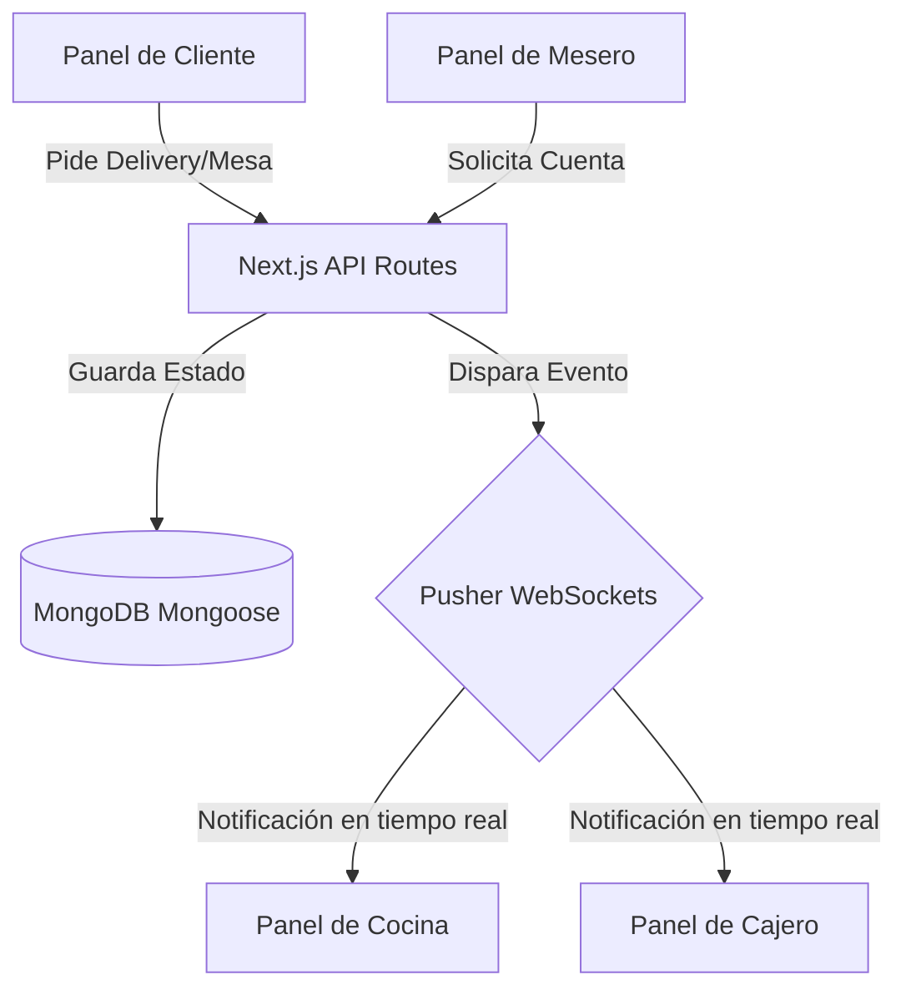

# Sabor & Gestión

Plataforma modular y escalable para la administración integral de restaurantes y cafeterías, diseñada para coordinar pedidos, cobros, cocina y segmentación de clientes en tiempo real.

---

## 🗺️ Arquitectura del Proyecto y Flujo de Trabajo

El sistema está desarrollado con **Next.js (App Router)** y sigue una arquitectura limpia que separa la interfaz de usuario, la lógica de negocio y las configuraciones del servidor. 

La sincronización en tiempo real entre los diferentes roles (clientes, meseros, cocina y cajeros) se realiza a través de WebSockets (Pusher):



---

## 📁 Estructura del Código

```bash
src/
├─ app/                 # Rutas de la aplicación Next.js (App Router)
│  ├─ api/              # Endpoints del Backend (Serverless Functions)
│  │  ├─ auth/          # Lógica de autenticación (JWT, Login)
│  │  ├─ users/         # CRUD de usuarios y empleados
│  │  ├─ categories/    # Gestión de categorías del menú
│  │  ├─ dishes/        # Gestión del menú de platos
│  │  └─ admin/         # Rutas de administración y segmentación
│  ├─ login/            # Vista de inicio de sesión
│  ├─ dashboard/        # Panel principal de administración y roles
│  ├─ layout.tsx        # Estructura y envolturas base de la aplicación
│  └─ page.tsx          # Página de inicio (Landing/Root)
│
├─ components/          # Componentes de React reutilizables
│  ├─ ui/               # Botones, inputs, modales (piezas básicas)
│  ├─ forms/            # Formularios complejos (Login, registro de platos)
│  ├─ layout/           # Barras laterales, navegación, headers
│  └─ clientScreen/     # Vistas y paneles específicos para el rol Cliente
│
├─ features/            # Lógica de negocio específica por módulo
│  ├─ auth/             # Hooks y lógica de autenticación
│  ├─ users/            # Funcionalidades específicas de usuarios
│  ├─ categories/       # Operaciones de categorías
│  └─ dishes/           # Operaciones de platos y menú
│
├─ lib/                 # Utilidades y configuraciones externas
│  ├─ db.ts             # Configuración y conexión a MongoDB (Mongoose)
│  └─ utils.ts          # Funciones auxiliares generales
│
├─ models/              # Esquemas de Mongoose (Modelos de Base de Datos)
│  ├─ User.ts           # Modelo de Usuario (Roles, contraseñas)
│  ├─ Category.ts       # Modelo de Categoría
│  ├─ LoyaltyTier.ts    # Modelo de Reglas de Segmentación
│  └─ Dish.ts           # Modelo de Plato/Producto
│
├─ validations/         # Esquemas de validación de datos
│  └─ ...               # Validación de inputs para evitar datos corruptos
│
├─ types/               # Definiciones de TypeScript e Interfaces
│  └─ index.ts          # Centralización de tipos del proyecto
│
└─ tests/               # Suite de pruebas
   ├─ unit/             # Pruebas de funciones aisladas
   └─ integration/      # Pruebas de flujo completo
```

---

## 🐳 Base de Datos Local con Docker

Para levantar una instancia local de MongoDB de manera rápida sin necesidad de instalar el servicio en tu sistema operativo principal, puedes ejecutar el siguiente comando si tienes **Docker** instalado:

```bash
docker run -d \
  --name sabor-db \
  -p 27017:27017 \
  -v sabor_data:/data/db \
  mongo:latest
```

Esto habilitará una base de datos local en `mongodb://localhost:27017` lista para conectar con el servidor de desarrollo.

---

## 🚀 Guía de Desarrollo Local

### 1. Iniciar el servidor de desarrollo
Ejecuta el servidor de desarrollo local utilizando tu gestor de paquetes preferido:

```bash
npm run dev
# o bien
yarn dev
# o bien
pnpm dev
```

Abre [http://localhost:3000](http://localhost:3000) en tu navegador para interactuar con la aplicación.

### 2. Control de Calidad Obligatorio
Antes de realizar un commit o abrir un Pull Request, es obligatorio ejecutar la suite de calidad local para evitar subir código con errores de sintaxis o tipado:

```bash
npm run check
```

Este script ejecuta secuencialmente:
- **Linting (`npm run lint`):** Verificación de estilo y sintaxis mediante ESLint.
- **Type-Checking (`npm run type-check`):** Verificación estática de tipos de TypeScript.
- **Build de Producción (`npm run build`):** Simulación de compilación productiva de Next.js.

---

## 🏗️ Compilación y Simulación de Producción

Para validar cómo se comportará la aplicación final en el entorno de despliegue, puedes compilar e iniciar el servidor localmente en modo producción:

```bash
# Compilar el proyecto optimizado
npm run build

# Iniciar el servidor compilado
npm run start
```

---

## 📝 Convención de Commits

Para mantener el historial del repositorio legible y facilitar la creación automatizada de versiones, sigue la convención de **Conventional Commits** al crear tus mensajes:

* **`feat:`** Nuevas características funcionales (ej. `feat: agregar validación de duplicados`).
* **`fix:`** Corrección de fallos o errores de código (ej. `fix: resolver conflicto de fusión en PaymentModal`).
* **`docs:`** Cambios únicamente en la documentación o el README (ej. `docs: actualizar readme con diagramas`).
* **`style:`** Formateo estético de código que no altera el comportamiento (espaciado, comillas).
* **`refactor:`** Reestructuración de código existente que no añade funciones ni corrige bugs.

---

## 🛠️ Solución de Problemas Comunes

### Errores de Conexión en Tiempo Real (Sockets)
Si experimentas retrasos o las actualizaciones instantáneas en las pantallas de cocina o cajero no se cargan, verifica que no tengas un firewall local bloqueando las peticiones salientes con el proveedor de sockets (Pusher).

### Comportamiento Errático en Caliente (Hot Reload stuck)
Si tras hacer un `git pull` o cambiar de rama el compilador muestra errores inconsistentes en el navegador, elimina la caché temporal de Next.js e inicia de nuevo:

```bash
# Limpiar caché de compilación en Linux/MacOS/GitBash
rm -rf .next

# En Windows PowerShell
Remove-Item -Recurse -Force .next

# Reiniciar servidor
npm run dev
```
